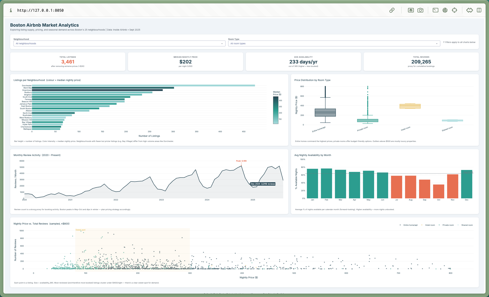

# Boston Airbnb Market Analytics Dashboard

> **Interactive Plotly Dash dashboard** exploring Boston's short-term rental market across 25 neighbourhoods.
> Built as a Data Science portfolio project using [Inside Airbnb](http://insideairbnb.com/) open data.



---

## Questions Answered

| # | Question |
|---|----------|
| 1 | What does Boston's Airbnb supply look like at a glance? |
| 2 | Which neighbourhoods have the most listings — and are they more or less expensive? |
| 3 | How does nightly price vary by room type? |
| 4 | When is demand (booking activity) highest throughout the year? |
| 5 | Is there an optimal price range that maximises bookings? |

---

## Dashboard Features

- **KPI cards** — total listings, median price, average availability, cumulative reviews
- **Neighbourhood supply chart** — listing count + median price encoded as colour gradient
- **Price distribution by room type** — box plot across all 4 room categories
- **Seasonal demand trend** — monthly review activity (2020–present) with peak annotation
- **Monthly availability** — forward-looking calendar data; below-average months highlighted
- **Price vs. Reviews scatter** — identifies the demand "sweet spot" (~$80–$300/night)
- **Unified filters** — neighbourhood and room-type dropdowns update all charts simultaneously

---

## Tech Stack

| Tool | Purpose |
|------|---------|
| Python 3.11 | Core language |
| Pandas / NumPy | Data wrangling |
| Plotly | Chart engine |
| Dash | Interactive web framework |
| Gunicorn | Production WSGI server |

---

## Data Sources

Downloaded from [Inside Airbnb — Boston](http://insideairbnb.com/boston) (snapshot: Sept 2025)

| File | Rows | Description |
|------|------|-------------|
| `listings.csv` | 4,419 | Listing metadata, price, room type, neighbourhood |
| `calendar.csv.gz` | 1.6 M | Daily availability & pricing (12-month forward) |
| `reviews.csv.gz` | 233 K | Guest reviews with timestamps (2009–2025) |

> ⚠️ Raw data files are excluded from this repo (`.gitignore`) due to size.
> Download them directly from [insideairbnb.com/get-the-data](http://insideairbnb.com/get-the-data/) and place them in the project root.

---

## Run Locally

```bash
# 1. Clone
git clone https://github.com/MadisonMLi/boston-airbnb-dashboard.git
cd boston-airbnb-dashboard

# 2. Install dependencies
pip install -r requirements.txt

# 3. Add data files to project root (see Data Sources above)

# 4. Launch
python dashboard.py
# → Open http://127.0.0.1:8050
```

---

## Deploy to Render (free tier)

1. Push this repo to GitHub
2. Go to [render.com](https://render.com) → **New Web Service** → connect your repo
3. Set:
   - **Build command:** `pip install -r requirements.txt`
   - **Start command:** `gunicorn dashboard:server`
4. Upload your data files as a [Render Disk](https://render.com/docs/disks) or host them on a public URL and update `DATA_DIR` in `dashboard.py`

---

## Key Findings

- **Dorchester** has the most listings (572); **Bay Village** commands the highest median prices
- **Entire homes** have a median price ~2× that of private rooms
- Demand peaks **May – October**, dropping sharply in Jan–Feb (→ price accordingly)
- The **$80–$300/night sweet spot** concentrates the most-reviewed listings
- ~56% of calendar nights are marked available — occupancy rate is solid but uneven by season

---

*Data Scientist Portfolio Project — Mengyao*
